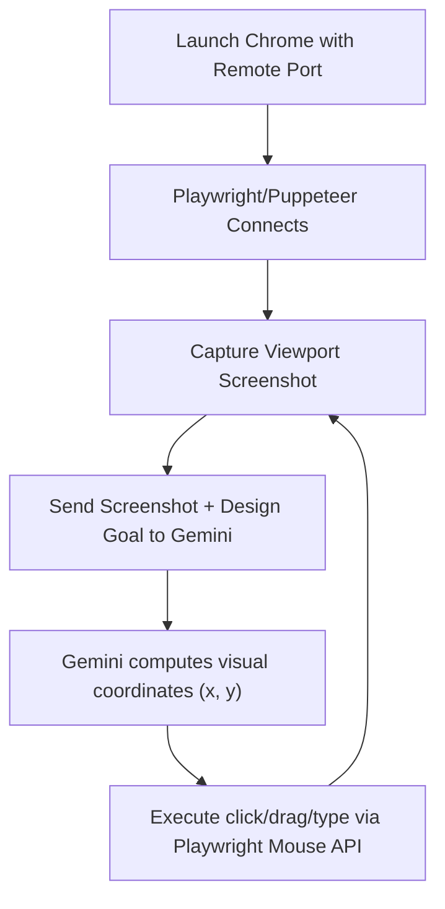

# Gemini 2.5 Computer Use for Visual Site Design 🚀

This repository contains instructions and sample code for leveraging the visual-spatial intelligence of **Gemini 2.5 Computer Use** in combination with a remote Chrome instance (`--remote-debugging-port`) to automate, test, and design websites directly on visual builders (e.g., Elementor, Webflow, Gutenberg, Figma) where traditional DOM selector-based scripting fails.

---

## 📖 Table of Contents
- [Overview](#-overview)
- [How It Works](#-how-it-works)
- [Key Design Use Cases](#-key-design-use-cases)
- [Quick Start Guide](#-quick-start-guide)
  - [Step 1: Launch Chrome with Remote Debugging](#step-1-launch-chrome-with-remote-debugging)
  - [Step 2: Install Dependencies](#step-2-install-dependencies)
  - [Step 3: Run the Agent](#step-3-run-the-agent)
- [Advanced Pattern: Hybrid Visual + DOM Control](#-advanced-pattern-hybrid-visual--dom-control)
- [Safety & Boundary Rules](#-safety--boundary-rules)

---

## 🔍 Overview

Traditional browser automation relies on DOM selectors (e.g., CSS classes, XPaths). However, modern visual site builders rely on canvas interfaces, complex iframe trees, and drag-and-drop workflows. 

By combining Gemini's visual coordinate model with Chrome's remote debugging, you establish a reactive visual automation loop that acts just like a human designer looking at the screen.

---

## ⚙️ How It Works

The runner connects to your active browser tab, captures a screenshot, feeds it to Gemini to compute coordinates for mouse/keyboard inputs, and dispatches the action via Playwright.



---

## 🎨 Key Design Use Cases

### 1. Drag-and-Drop Layout Building
Visual builders require moving widgets from a sidebar panel to a precise landing spot on the canvas. Gemini reviews the screenshot, identifies the widget panel and the target drop zone, and provides exact start/end coordinates.

### 2. Spacing & Alignment Audits
Instruct the agent to verify layouts against design rules, such as a **1250px Signature Grid** or an **80/50/35 Spacing Protocol** (80px Desktop / 50px Tablet / 35px Mobile padding). The agent takes screenshots at responsive breakpoints and flags padding overflows or element wrapping issues.

### 3. Interactive State Verification
Static screenshots cannot audit dynamic behaviors like hover animations, drop-downs, mobile drawers, or modal popups. The agent visually spots the interactive elements, simulates clicks or hovers, and verifies that the site responds correctly.

---

## 🚀 Quick Start Guide

### Step 1: Launch Chrome with Remote Debugging

Close all active instances of Chrome and launch a new instance with the remote debugging port enabled.

*   **Windows (PowerShell):**
    ```powershell
    & "C:\Program Files\Google\Chrome\Application\chrome.exe" --remote-debugging-port=9222 --user-data-dir="C:\Users\YourUsername\ChromeRemoteProfile"
    ```
*   **macOS (Terminal):**
    ```bash
    /Applications/Google\ Chrome.app/Contents/MacOS/Google\ Chrome --remote-debugging-port=9222 --user-data-dir="/tmp/chrome-profile"
    ```
*   **Linux (Terminal):**
    ```bash
    google-chrome --remote-debugging-port=9222 --user-data-dir="/tmp/chrome-profile"
    ```

*Make sure to log in to your visual site builder (e.g., WP Admin, Webflow dashboard) in this browser window to store session cookies.*

### Step 2: Install Dependencies

Navigate to the `examples` directory and install the node dependencies:

```bash
cd examples
npm install
```

### Step 3: Run the Agent

Set your Gemini API key in your environment and run the agent script, specifying your visual goal:

```bash
# Set API Key (Windows PowerShell)
$env:GEMINI_API_KEY="your-api-key-here"

# Run Agent
node visual-agent.js "Click on the main site logo, then verify that the mobile hamburger menu opens on a 375px viewport"
```

---

## 🧩 Advanced Pattern: Hybrid Visual + DOM Control

To minimize coordinate drift caused by high-DPI displays or browser zoom settings, combine visual layout understanding with programmatic DOM queries:

1. **Identify Visually:** Ask Gemini to locate the component (e.g., `"The blue 'Style' panel tab in the Elementor settings bar"`).
2. **Find Element Bounds:** Use Playwright's locator to search the active DOM and return the exact bounding box:
   ```javascript
   const element = page.locator('div:has-text("Style")').first();
   const box = await element.boundingBox();
   ```
3. **Execute Precisely:** Click the absolute center of the bounding box rather than raw coordinates predicted by the visual model:
   ```javascript
   await page.mouse.click(box.x + box.width / 2, box.y + box.height / 2);
   ```

---

## 🔒 Safety & Boundary Rules

1. **Viewport Containment:** The agent must only interact within the page viewport (coordinates `[0,0]` to `[width, height]`). It should never interact with Chrome's address bar, tabs, extensions, or the underlying OS.
2. **Step Verification:** The agent must capture a screenshot after every action to verify that the visual interface has successfully updated before executing the next action.
3. **Modal Dismissal:** If an popup, overlay, or cookies banner blocks the layout, Gemini must prioritize identifying the dismiss/close button before attempting the core design objective.
