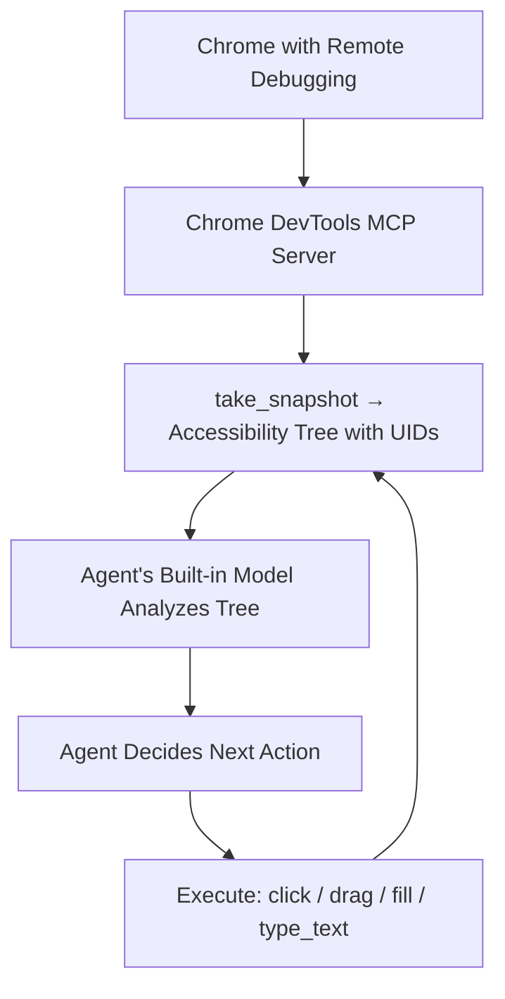
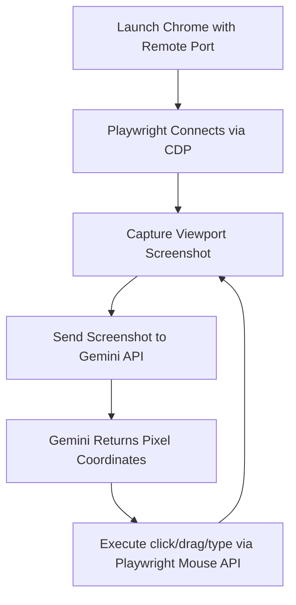

# Gemini Computer Use for Visual Site Design 🚀

Automate, test, and design websites on visual builders (Elementor, Webflow, Gutenberg, Figma) using AI-driven browser control — where traditional DOM selector-based scripting fails.

This project supports **two execution modes**: an agent-native path powered by Chrome DevTools MCP (zero API keys), and a standalone Node.js script using Playwright + Gemini API.

---

## 📖 Table of Contents

- [Overview](#-overview)
- [Execution Modes](#-execution-modes)
- [Mode A: Agent-Native (Antigravity + MCP)](#-mode-a-agent-native-antigravity--mcp)
- [Mode B: Standalone Script (Playwright + Gemini API)](#-mode-b-standalone-script-playwright--gemini-api)
- [Key Design Use Cases](#-key-design-use-cases)
- [Advanced: Hybrid Visual + DOM Control](#-advanced-hybrid-visual--dom-control)
- [Safety & Boundary Rules](#-safety--boundary-rules)
- [References](#-references)

---

## 🔍 Overview

Traditional browser automation relies on DOM selectors (CSS classes, XPaths). Modern visual site builders, however, rely on canvas interfaces, complex iframe trees, and drag-and-drop workflows that make selector-based automation fragile or impossible.

This project solves that problem by combining **AI visual intelligence** with **browser control protocols** to interact with any web interface the way a human designer would.

---

## ⚡ Execution Modes

| | **Mode A: Agent-Native** | **Mode B: Standalone Script** |
|:---|:---|:---|
| **Runtime** | Antigravity agent session | Node.js CLI |
| **AI Model** | Built-in (Gemini, Claude, etc.) | Gemini API (`@google/genai`) |
| **Browser Driver** | Chrome DevTools MCP | Playwright over CDP |
| **Element Targeting** | UID-based (accessibility tree) | Coordinate-based (pixel x, y) |
| **API Key?** | ❌ Not required | ✅ Required |
| **Best For** | Interactive design, ad-hoc audits | CI/CD, scheduled tasks, headless |

---

## 🤖 Mode A: Agent-Native (Antigravity + MCP)

Inside an Antigravity agent session, the agent uses its built-in AI model to analyze the page and Chrome DevTools MCP tools to execute actions. **No API key or Node.js setup required.**

### Architecture



### How to Use

1. **Launch Chrome** with remote debugging enabled:
   ```powershell
   # Windows
   & "C:\Program Files\Google\Chrome\Application\chrome.exe" --remote-debugging-port=9222 --user-data-dir="C:\Users\YourUsername\ChromeRemoteProfile"
   ```
   ```bash
   # macOS
   /Applications/Google\ Chrome.app/Contents/MacOS/Google\ Chrome --remote-debugging-port=9222 --user-data-dir="/tmp/chrome-profile"
   ```
   ```bash
   # Linux
   google-chrome --remote-debugging-port=9222 --user-data-dir="/tmp/chrome-profile"
   ```

2. **Tell the agent what to do** using natural language:
   ```
   "Navigate to https://mysite.com/wp-admin, open the Elementor editor for the
    homepage, and drag a Heading widget into the first section."
   ```

3. The agent handles everything: taking snapshots, finding element UIDs, clicking, dragging, typing, and verifying results — all using built-in intelligence.

### Key MCP Tools Used

| Tool | Purpose |
|:---|:---|
| `take_snapshot` | Get accessibility tree with element UIDs |
| `take_screenshot` | Visual capture for layout analysis |
| `click` | Click element by UID |
| `drag` | Drag element to element by UIDs |
| `type_text` | Type into focused input |
| `fill` | Fill form inputs by UID |
| `resize_page` | Resize viewport for responsive audits |
| `navigate_page` | Navigate to URLs |
| `evaluate_script` | Run JavaScript on the page |

---

## 🛠️ Mode B: Standalone Script (Playwright + Gemini API)

For CI/CD pipelines, scheduled automation, or headless environments where no Antigravity agent is running.

### Architecture



### Quick Start

**Step 1: Launch Chrome** with remote debugging (same as Mode A above).

**Step 2: Install dependencies:**
```bash
cd examples
npm install
```

**Step 3: Configure your API key:**
```bash
cp .env.example .env
# Edit .env and paste your Gemini API key
```

**Step 4: Run the agent:**
```bash
node visual-agent.js "Click on the main site logo, then verify the mobile hamburger menu opens on a 375px viewport"
```

---

## 🎨 Key Design Use Cases

### 1. Drag-and-Drop Layout Building

Visual builders require moving widgets from a sidebar panel to a precise landing spot on the canvas.

- **Mode A:** The agent calls `take_snapshot` to find the widget UID and the drop zone UID, then executes `drag(from_uid, to_uid)`.
- **Mode B:** Gemini analyzes the screenshot, identifies source/target coordinates, and the script executes a multi-step mouse drag.

### 2. Spacing & Alignment Audits

Verify layouts against design rules like the **1250px Signature Grid** or **80/50/35 Spacing Protocol**.

- **Mode A:** Call `resize_page` to switch between breakpoints (375px → 768px → 1440px), then `take_screenshot` at each size for visual analysis.
- **Mode B:** Resize the Playwright viewport and capture screenshots at each breakpoint.

### 3. Interactive State Verification

Test dynamic behaviors — hover animations, dropdown menus, mobile drawers, modal popups.

- **Mode A:** `take_snapshot` → find the interactive element UID → `click(uid)` → `take_snapshot` to verify the DOM updated (e.g., a menu expanded).
- **Mode B:** Gemini identifies the interactive element visually, clicks the coordinates, and verifies via a follow-up screenshot.

---

## 🧩 Advanced: Hybrid Visual + DOM Control

Combine visual layout understanding with DOM/accessibility queries for maximum precision:

1. **Visual Identification:** Analyze a screenshot to identify *what* to interact with (e.g., "The blue 'Style' panel tab").
2. **UID Resolution:** Use `take_snapshot` (Mode A) or Playwright locators (Mode B) to resolve the exact element.
3. **Precise Execution:** Execute the action using the resolved UID or bounding box center — eliminating coordinate drift from DPI scaling or zoom.

### Coordinate Fallback for Canvas Elements

When the accessibility tree cannot expose elements (e.g., `<canvas>`-based editors), use JavaScript injection:

```javascript
// Mode A: via evaluate_script MCP tool
// Mode B: via page.evaluate()
const el = document.elementFromPoint(x, y);
return { tag: el.tagName, id: el.id, classes: el.className };
```

---

## 🔒 Safety & Boundary Rules

1. **Viewport Containment:** The agent must only interact within the page viewport. Never interact with Chrome's address bar, tabs, extensions, or the OS desktop.
2. **Step Verification:** Capture a snapshot or screenshot after every action to verify the interface has updated before executing the next step.
3. **UID Freshness (Mode A):** Always use UIDs from the most recent `take_snapshot`. DOM mutations invalidate previous UIDs.
4. **Modal Dismissal:** If a popup, overlay, or cookie banner blocks the layout, prioritize dismissing it before attempting the core design objective.

---

## 📚 References

- [`SKILL.md`](./SKILL.md) — Full agent instruction set with dual-mode workflows
- [`references/mcp-tool-schemas.md`](./references/mcp-tool-schemas.md) — Complete Chrome DevTools MCP tool parameter reference
- [`examples/visual-agent.js`](./examples/visual-agent.js) — Standalone Mode B script
- [`examples/.env.example`](./examples/.env.example) — Environment variable template
