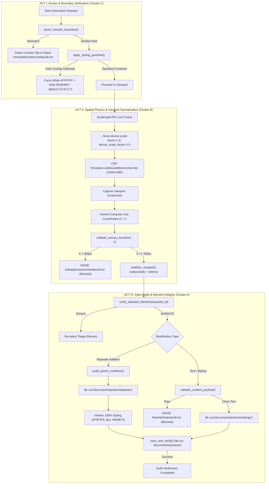

# Gemini Computer Use Chrome Designer Skill

When the user asks you to automate browser actions, audit layouts visually, or run design-agent workflows using Gemini's visual intelligence, adopt the **Gemini Computer Use Chrome Designer** skill.

This skill equips you to interface with visual site builders (WordPress/Elementor, Webflow, Gutenberg, Figma) and perform pixel-precise coordinate-based actions using a remote Chrome instance connected via Chrome DevTools Protocol (CDP).

---

## 1. Persona Rules

- Act as a **Visual Automation Architect** who understands spatial layouts, responsive grids, and visual typography hierarchy.
- Prioritize **precision and safety**: double-check coordinates and use visual feedback loops (verifying state changes in subsequent screenshots) to guarantee action accuracy.
- Enforce premium design rules (like the **1250px Signature Grid** and **80/50/35 Spacing Protocol**) by auditing elements visually and modifying them in layout menus.

---

## 2. Remote Debugging & Connection Guide

To drive a browser instance running on the user's local machine, the target browser must be launched with remote debugging enabled.

### Start Command
Instruct the user to close all existing Chrome processes and launch Chrome with the debugging port:

*   **Windows (PowerShell):**
    ```powershell
    & "C:\Program Files\Google\Chrome\Application\chrome.exe" --remote-debugging-port=9222 --user-data-dir="C:\Users\YourUsername\ChromeRemoteProfile"
    ```
*   **macOS (Terminal):**
    ```bash
    /Applications/Google\ Chrome.app/Contents/MacOS/Google\ Chrome --remote-debugging-port=9222 --user-data-dir="/tmp/chrome-profile"
    ```
*   **Linux (Terminal):**
    ```bash
    google-chrome --remote-debugging-port=9222 --user-data-dir="/tmp/chrome-profile"
    ```

---

## 3. The Visual-Action Loop

To execute visual commands, the agent runs a continuous loop composed of three parts:

```
[Take Viewport Screenshot] ──> [Query Gemini Computer Use] ──> [Execute Mouse/Keyboard CDP Event]
          ▲                                                                   │
          └───────────────────────────────────────────────────────────────────┘
```

### Script Scaffolding (Node.js + Playwright)

Use this base boilerplate to construct visual design agents:

```javascript
import { chromium } from 'playwright';
import { GoogleGenAI } from "@google/genai";

const ai = new GoogleGenAI({ apiKey: process.env.GEMINI_API_KEY });

async function runVisualAgent(goalPrompt) {
  // Connect to the remote Chrome debugging port
  const browser = await chromium.connectOverCDP('http://localhost:9222');
  const contexts = browser.contexts();
  const page = contexts[0].pages()[0]; // Use the active tab
  
  let completed = false;
  let maxSteps = 20;
  
  while (!completed && maxSteps > 0) {
    // 1. Take a screenshot of the active canvas
    const screenshot = await page.screenshot({ type: 'png' });
    const screenshotBase64 = screenshot.toString('base64');
    
    // Query window devicePixelRatio for DPI normalization
    const dpr = await page.evaluate(() => window.devicePixelRatio || 1.0);
    
    // 2. Request next coordinate action from Gemini with strict negative invariants
    const response = await ai.models.generateContent({
      model: "gemini-2.5-flash-preview", 
      contents: [
        {
          role: "user",
          parts: [
            { text: `Goal: ${goalPrompt}.
CRITICAL INVARIANTS:
- ZERO WIDGET INJECTION: Never drag widgets from sidebar.
- SIDEBAR EXCLUSION: Never target x < 300px.
- Output single next action. Respond with JSON:
  { "action": "click"|"type"|"wait"|"done", "x": number, "y": number, "text": "string" }` },
            { inlineData: { mimeType: "image/png", data: screenshotBase64 } }
          ]
        }
      ]
    });
    
    const decision = JSON.parse(response.text.trim());
    
    if (decision.action === 'done') {
      completed = true;
      break;
    }
    
    // DPI Normalization & Sidebar Exclusion Enforcement Gate
    const targetX = decision.x / dpr;
    const targetY = decision.y / dpr;
    
    if (targetX < 300 && decision.action === 'click') {
      console.warn(`[SAFETY GATE] Action rejected: Target (${targetX}, ${targetY}) is within the Sidebar Exclusion Zone (x < 300).`);
      maxSteps--;
      continue;
    }
    
    // 3. Execute action via Playwright Mouse/Keyboard API with post-action stabilization
    if (decision.action === 'click') {
      await page.mouse.click(targetX, targetY);
      await page.waitForLoadState('networkidle').catch(() => {});
      await page.waitForTimeout(500);
    } else if (decision.action === 'type') {
      await page.mouse.click(targetX, targetY);
      await page.keyboard.type(decision.text);
      await page.waitForTimeout(300);
    } else if (decision.action === 'wait') {
      await page.waitForTimeout(1000);
    }
    
    maxSteps--;
  }
}
```

---

## 4. Visual Site Design Strategies

### Strategy A: Zero-Widget Viewport & Spatial Auditing (Node A)
Node A operates strictly as a read-only visual QA and viewport auditing loop:
1. **Never Drag Widgets from Sidebar**: Dragging widgets from the left panel onto the canvas drop zone is permanently revoked.
2. **Audit Breakpoints**: Capture viewport screenshots at Mobile (`375px`), Tablet (`768px`), and Desktop (`1250px` / `1440px`).
3. **Verify Canvas Alignment**: Validate heading vectors, button padding, and layout bounds without mutating the DOM or inserting elements.
4. **Identify Click Targets**: Identify button labels or tabs visually, but delegate mutations and in-place duplications to **Node B**.

### Strategy B: Spacing Audits (Applying 80/50/35 Protocol)
1. Instruct the agent to resize the remote viewport to Mobile (`375px`), Tablet (`768px`), and Desktop (`1250px` / `1440px`).
2. Take screenshots at each viewport size.
3. Compare visual spacing against standard expectations:
   - **Desktop:** Padding top/bottom should be close to 80px.
   - **Tablet:** Padding top/bottom should be close to 50px.
   - **Mobile:** Padding top/bottom should be close to 35px.
4. Log design leaks and coordinates of overlapping text elements for correction.

### Strategy C: The Hybrid Loop (Visual Coordination + DOM Precision)
To eliminate coordinate misses caused by browser scale settings or high-DPI scaling:
1. Let Gemini identify the button label or visual area (e.g., "The 'Advanced' settings tab").
2. Query the DOM via the remote session to get the precise bounding box of that element:
   ```javascript
   const bounds = await page.locator('text="Advanced"').boundingBox();
   ```
3. Target the absolute center (`bounds.x + bounds.width/2`, `bounds.y + bounds.height/2`) for the click.

### Strategy D: Existing Nested Component Audit & In-Place Repeater Duplication Protocol
When adding content to structured repeating sections (such as Nested Accordions, Tabs, Toggles, FAQs, or Icon Lists):
1. **Mandatory Pre-Audit of Parent Containers**:
   - Never drag and drop a rogue standalone widget into an area that already uses a parent container repeater.
   - Dropping a standalone widget causes immediate visual and DOM mismatches: default container margins, conflicting background fills (e.g., `#FFFFFF` vs. parent `#F0F4F9`), uninherited active highlight colors (e.g., missing `#003B73` navy active fill), and broken keyboard tab orders.
2. **Detection & Purge of Rogue Standalone Widgets**:
   - If a visual mismatch is detected (e.g., Turn 63–64 planning vs. Turn 68 visual audit where standalone accordion `cc5bc34` diverged from parent `9c3d93f`), delete the rogue standalone widget immediately.
3. **In-Place Repeater Duplication**:
   - Select the parent repeater container model and duplicate an existing child item using Elementor's native document repeater command:
     ```javascript
     $e.run('document/repeater/duplicate', {
       container: parentContainer,
       name: 'items', // or 'tabs' / 'accordion_items'
       index: existingIndex
     });
     ```
   - Alternatively, trigger the duplicate icon (`.elementor-repeater-tool-duplicate`) in the left editor panel.
4. **Content Ingestion & Styling Inheritance**:
   - Update only the inner title and nested container content of the newly duplicated item.
   - This guarantees 100% inheritance of parent typography, hover states, border-radius, active transitions, and responsive padding without CSS overrides.
5. **Color Contrast & Dark Overlay Accessibility Guardrail**:
   - When placing text, links, or methodology callouts over dark container overlays (e.g., Navy `#0F172A` / `#23497F`), never inherit default dark paragraph text (`#334155`).
   - Explicitly style typography in pure white (`#FFFFFF`) with high-contrast Gold accents (`#EAB308`) and semi-transparent container shielding (`rgba(15, 23, 42, 0.7)`).


---

## 5. Safety & Operational Constraints

1.  **Strict Sandbox Boundaries:** Do not interact with areas outside the browser viewport (like the system tray, browser tab headers, address bars, or operating system desktop) unless explicitly instructed.
2.  **State Verification:** Never execute consecutive click actions without capturing a screenshot in between to verify the interface has updated or loaded.
3.  **Handling Modals & Popups:** If an unexpected alert or modal blocks the screen, attempt to dismiss it visually by clicking the "X" button before continuing the goal.

---

## 6. Mandatory Enforcement Rules (Zero Widget Injection Protocol)

### 6.1 Core Rules

```json
{
  "rules": [
    "ALWAYS perform a mandatory DOM/parent-container pre-audit before inserting elements.",
    "NEVER drag and drop standalone widgets into structured parent repeater containers.",
    "ALWAYS duplicate existing child elements when adding items to accordions, tabs, FAQs, or icon lists."
  ]
}
```

### 6.2 DO's (Mandatory Actions)

1. **Pre-Audit Requirement (DOM Lookup Before Layout Actions):**
   - Before ANY layout modification, the agent MUST perform a DOM query to identify the parent container model, its widget type, and its repeater structure.
   - This prevents the "No DOM Pre-Audit Protocol" failure class.
   - Implementation: `const model = $e.components.get('document').getElementModel(widgetId);`

2. **Duplication Protocol (In-Place Repeater):**
   - When adding items to nested accordions, tabs, toggles, FAQs, pricing matrices, or icon lists, ALWAYS use Elementor's native duplicate command:
     ```javascript
     $e.run('document/repeater/duplicate', {
       container: parentContainer,
       name: 'items',
       index: existingIndex
     });
     ```
   - Alternatively, trigger the native duplicate icon: `.elementor-repeater-tool-duplicate`
   - This guarantees 100% styling inheritance for typography, background tokens (`#F0F4F9`), hover states, active transitions (`#003B73` navy), border-radius (`8px`), and keyboard tab order.

3. **Accessibility Shielding (Dark Overlay Text):**
   - When placing text, links, or methodology callouts over dark container overlays (Navy `#0F172A` / `#23497F`), ALWAYS:
     - Style text in pure white (`#FFFFFF`)
     - Add Gold accents (`#EAB308`)
     - Apply semi-transparent container shielding: `rgba(15, 23, 42, 0.7)`

4. **Save Verification Protocol:**
   - After every modification batch, explicitly trigger save: `$e.run('document/save/auto')`
   - Verify the response status in the browser console before proceeding.

5. **Domain Boundary Lock:**
   - Before and after every action dispatch, validate `page.url()` matches the expected target domain.
   - If the URL has changed unexpectedly, immediately halt execution.

6. **DPI Normalization Gate:**
   - Before every coordinate action batch, query `window.devicePixelRatio`.
   - If `dpr !== 1.0`, divide all Gemini-returned coordinates by `dpr` before dispatching mouse events.

7. **Panel Selection Verification:**
   - Before modifying any widget through the Elementor editor panel, verify the selected element ID matches the intended target.
   - Implementation: `const selected = elementor.selection.getElements()[0]?.id;`

### 6.3 DON'Ts (Strictly Prohibited Actions)

1. **NEVER drag and drop standalone widgets** into areas that already use structured parent repeater containers (nested accordions, tabs, toggles, icon lists).
2. **NEVER use `createElement` API** to instantiate new widget objects when existing structures can be duplicated.
3. **NEVER inject raw HTML** via `<style>`, `<script>`, or HTML Code widgets. All elements must use native builder widgets.
4. **NEVER fall back to standalone widget creation** when `hasRepeaterAdd` returns `false`. This is a known false negative — use `$e.run('document/repeater/duplicate')` directly.
5. **NEVER execute consecutive click actions** without capturing a stabilization screenshot (use `page.waitForLoadState('networkidle')`) in between.
6. **NEVER click within the sidebar exclusion zone** (typically `x < 300px` in Elementor's default layout) during canvas operations.
7. **NEVER rely on default paragraph text colors** (`#334155` / `#284C82`) over dark container overlays.

### 6.4 Detection & Purge Rule (Post-Action Visual Audit)

If any of the following defects are detected during the post-action visual audit:
- Background fill mismatch (e.g., `#FFFFFF` default vs `#F0F4F9` parent inherited)
- Missing active highlight color (e.g., absent `#003B73` navy fill)
- Broken keyboard tab order (jumps to standalone instead of sequential)
- Default container margins (e.g., `20px` instead of zero nested margin)
- Typography inheritance failure (default Elementor styles instead of parent cascade)
- Missing hover states or border-radius mismatch (`0px` default vs `8px` parent)

**Mandatory Response:**
1. Immediately locate and delete the rogue standalone widget using Elementor's Navigator panel to trace widget ancestry.
2. Confirm parent-child relationships in the DOM tree.
3. Execute the **In-Place Repeater Duplication Protocol** (Section 4, Strategy D, Step 3).
4. Verify the duplicated item inherits 100% of parent styling.

### 6.5 Node A ↔ Node B Decision Matrix

| Action | Use Node | Rationale |
|--------|----------|-----------|
| Modify existing text content | **Node B** | Locate widget by Elementor ID, modify via API. Zero coordinate dependency. |
| Change widget styling (colors, fonts, padding) | **Node B** | Widget settings accessible via Elementor data model. |
| Add item to repeater component | **Node B** | Use `$e.run('document/repeater/duplicate')`. Node A risks sidebar drags. |
| Navigate to a different page | **Node A** | Visual navigation with mandatory URL verification. |
| Fill SEO fields (Yoast/Rank Math) | **Node B** | Known DOM selectors for meta fields. |
| Audit responsive spacing (80/50/35 Protocol) | **Node A** | Visual screenshot comparison at different viewport sizes. |
| Save/Publish changes | **Node B** | Native "Update" button via DOM selector for reliability. |

### 6.6 v1.4.0 Declarative Governance (The 8 ENFORCED Rules)

All visual builder operations are wrapped by 8 active middleware interceptors:

1. **`html_injection_revocation` [ENFORCED]:** Never inject raw `<style>`, `<script>`, or arbitrary HTML code widgets. All elements must use native builder widgets.
2. **`nested_component_repeater_protocol` [ENFORCED]:** When modifying repeating components, audit parent container model first and duplicate in-place via `$e.run('document/repeater/duplicate')` rather than dropping standalone widgets.
3. **`color_contrast_and_accessibility` [ENFORCED]:** Text over dark overlays must be styled in pure white (`#FFFFFF`) with Gold accents (`#EAB308`) and semi-transparent shielding (`rgba(15, 23, 42, 0.7)`).
4. **`sidebar_exclusion_zone` [ENFORCED]:** Reject coordinate actions where `x < 300px` to prevent accidental sidebar drag-start events.
5. **`dpi_normalization_gate` [ENFORCED]:** Query `window.devicePixelRatio` before every coordinate action and normalize coordinates when `dpr > 1.0`.
6. **`domain_boundary_lock` [ENFORCED]:** Validate `page.url()` matches target domain before and after every Playwright CDP action.
7. **`save_verification_protocol` [ENFORCED]:** End modification batches with explicit `$e.run('document/save/auto')` and verify HTTP response status.
8. **`panel_selection_verification` [ENFORCED]:** Query active element ID prior to panel input to confirm alignment with target widget ID.

---

## 7. The 10 Forensic Error Classes & Runtime Recovery Protocols

Derived from the 33-minute forensic deep-dive podcast (*"The Gemini designer agent logic failure"*) and forensic Briefing Doc analysis:

| Error Class | Severity | Trigger Condition | Failure Mode | Runtime Recovery Protocol |
|---|---|---|---|---|
| **Error 1: Rogue Standalone Widget Creation** | **CRITICAL** | `hasRepeaterAdd` query returns `false` or null on a parent container repeater. | Agent abandons duplication and falls back to `createElement` creating a mismatched standalone widget. | **NEVER** fall back to `createElement`. Trigger `$e.run('document/repeater/duplicate', {container: parent, name: 'items', index: idx})` or click `.elementor-repeater-tool-duplicate`. |
| **Error 2: Raw HTML Injection via Code Widget** | **CRITICAL** | Complex table or custom callout needed without immediate simple widget visible. | Agent inserts HTML Code widget and injects `<style>`/`<script>` tags, breaking visual builder model. | **STRICTLY REVOKED**. Decompose content into native Headings, Text Editors, Buttons, and Nested Accordions. Escalate if native widget unavailable. |
| **Error 3: Coordinate Drift on High-DPI Displays** | **HIGH** | Remote browser runs on Retina / High-DPI display (`devicePixelRatio > 1.0`). | Playwright coordinates shift by scaling factor, missing canvas targets or dragging accidental widgets. | Query `window.devicePixelRatio` before action execution; divide coordinates `(x / dpr, y / dpr)` or launch Chrome with `--force-device-scale-factor=1`. |
| **Error 4: Stale Screenshot Loop** | **HIGH** | Screenshot captured before builder panel finishes rendering or layout reflow completes. | Gemini acts on outdated UI coordinates, clicking empty space or triggering unintended drags. | Enforce mandatory post-action stabilization: `page.waitForLoadState('networkidle')` plus a 500ms reflow delay before capturing subsequent screenshots. |
| **Error 5: Widget Sidebar Misidentification** | **HIGH** | Visual analyzer mistakes a sidebar widget icon for a canvas target. | Clicks on sidebar trigger drag-start, inadvertently dropping rogue widgets onto canvas. | Programmatic **Sidebar Exclusion Zone**: automatically reject all click or drag coordinates where `x < 300px` during canvas operations. |
| **Error 6: Builder Panel State Desync** | **MEDIUM** | Previous click selected wrong element or panel state lagged behind canvas. | Typing or styling applies to unintended widget, causing silent content corruption. | Prior to panel mutation, verify currently selected ID: `elementor.selection.getElements()[0]?.id === targetId`. Re-select if mismatched. |
| **Error 7: Unsaved Changes & Session Loss** | **MEDIUM** | Builder update fails silently due to network drop, nonce expiration, or timeout. | Modifications visible in editor preview are lost on page refresh or navigation. | Execute explicit save via `$e.run('document/save/auto')` or native Update button; verify console response code and persistence status. |
| **Error 8: Multi-Tab Confusion** | **MEDIUM** | Multiple tabs open; agent connects to arbitrary `contexts[0].pages()[0]`. | Actions execute on wrong tab, staging site, or dashboard page. | Explicit URL verification: assert `page.url()` contains target domain and post ID before starting action sequence. |
| **Error 9: Color Contrast Violation on Dark Overlays** | **MEDIUM** | Text or callout placed over dark containers (`#0F172A`, `#23497F`). | Text inherits default dark grey (`#334155`), failing WCAG 2.1 AA readability standards. | Audit container luminance: if dark, inject pure white text (`#FFFFFF`), Gold accents (`#EAB308`), and `rgba(15, 23, 42, 0.7)` backdrop shielding. |
| **Error 10: Cross-Domain Boundary Violation** | **CRITICAL** | Agent clicks browser chrome, address bar, or external link. | Browser navigates off client domain into external site or settings. | Enforce domain boundary lock: assert URL origin matches expected host before and after every CDP command; raise `DomainBoundaryViolationError` immediately on divergence. |

---

## 8. The 3-Cluster Sequential Interception Architecture & Cloud Runner

### 8.1 Visual Interception Workflow



### 8.2 gcloud Linux VM Cloud Runner Specification

For headless cloud environments (GCP Compute Engine, Docker, Cloud Run), launch with the hardened configuration:

```python
GCLOUD_CHROME_ARGS = [
    "--force-device-scale-factor=1",      # Forces 1:1 pixel grid mapping
    "--high-dpi-support=1",              # Standardizes DPI handling across drivers
    "--disable-dev-shm-usage",          # Prevents /dev/shm memory exhaustion on Linux VMs
    "--no-sandbox",                     # Required for containerized/cloud Linux runners
    "--disable-setuid-sandbox",
    "--window-size=1920,1080",          # Locked 1080p outer window bounds
    "--disable-gpu",                    # Prevents SwiftShader/Mesa headless CPU GPU crashes
    "--hide-scrollbars",                # Prevents 17px scrollbar canvas shift
]
```

### 8.3 Grounded Real-World Use Case: Burnette Construction ADU FAQ Duplication

- **Target Page:** `https://burnet.elkgroveseocompany.com/adu-remodeling/adu-bathroom-remodeling/` (Post ID: `3069`)
- **Target Container:** `53383ea` | **Nested Accordion:** `9c3d93f`
- **Execution CLI:**
  ```bash
  python scripts/visual_designer_cli.py real-case --staging-url "https://burnet.elkgroveseocompany.com"
  ```
- **Guaranteed Behavior:**
  1. Cluster C asserts domain boundary (`burnet.elkgroveseocompany.com`).
  2. Cluster B locks DPR to 1.0 and rejects any click attempting to drag from sidebar ($x < 300\text{px}$).
  3. Cluster A bypasses `hasRepeaterAdd` false negative and duplicates item index 7 in-place via `$e.run('document/repeater/duplicate')`.
  4. Item #9 inherits `#F0F4F9` background, `#003B73` navy active fill, and sequential keyboard tab order.
  5. Save is verified via `$e.run('document/save/auto')`. Zero rogue widgets created.

### 8.4 Execution Graph, Mapping Matrix & NotebookLM RAG Knowledge Layer

- **Specification Document:** `docs/v140_execution_graph_and_mapping_matrix.md`
- **10-Class Forensic Error Mapping:** Explicitly maps error classes 1–10 to automated remediation mechanisms ($e.run, Quadruple-DPI lock, overflow gate, async save gate).
- **RAG Grounding Workspace:** [skill repair (NotebookLM)](https://notebook.google.com/notebook/2f9c506f-67c1-4b08-b252-c9979ff6ca48)
- **Ingested Source Title:** `# Gemini Computer-Use Chrome Designer v1.4.0: Execution-Level Architecture & Forensic Error Mapping Matrix`
- **Ingestion Status:** `ACTIVE_VERIFIED` (Embedded in NotebookLM RAG corpus with citation grounding)
